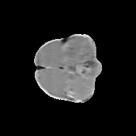
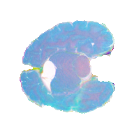
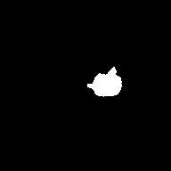

# BraTS Dataset 2D Preprocessor for YOLO Object Detection and U-Net Segmentation





## Summary

This repository provides a set of utility scripts to preprocess 3D `.nii.gz` Brain Tumor Segmentation Challenge (BraTS) brain scans into 2D "PNG slices" suitable for YOLO object detection, YOLO segmentation, and U-Net segmentation training. All scripts are in the `utils/` directories and are accessible via command-line arguments, and help can be accessed using the `--help` option to view contextual information. 

## Features

- Converts BraTS `.nii.gz` files to 2D PNG slices.
- Splits into single modalities (e.g., `t1c`, `t1n`, `t2f` and `t2w`)
- Preprocess, and clean images and masks while applying a central crop (reducing image dimensions)
- Prepares dataset into U-Net Segmentation, YOLO Object Detection, and YOLO Segmentation formats
- Stacks all single modality into a multi-modal PNG image
- Supports easy customization through command-line arguments.

## How to Use

1. **Sign Up to the BraTS Competition:**
   - Visit the [BraTS challenge website](https://www.synapse.org/brats2025) and sign up to download the dataset.

2. **Download the Dataset:**
   - Obtain the BraTS dataset for your desired year or edition.

3. **Make the Script Executable:**
   ```bash
   chmod +x process_segmentation_detection.sh
   chmod +x process_yoloseg.sh
    ```
4. **Set the Dataset Directory:**
   - Open `process_segmentation_detection.sh` (or `process_yoloseg.sh`) and update the `--in_dir` variable to point to your BraTS dataset directory.
   - Alternatively, you can specify the dataset directory directly as a command-line argument.
   - Please review the bash commands and the comments, if you want to train a single modality and not stacked modality. `process_segmentation_detection.sh` processes the dataset for U-Net segmentation, YOLO object detection, while `process_yoloseg.sh`processes the dataset for YOLO segmentation. 
   
5. **Run the Preprocessing Script:**
   ```bash
   ./process_segmentation_detection.sh
    ```
    - This will generate 2 directories (U-Net segmentation, YOLO object detection format), and remove all temporary directories, ensure your system have enough storage
   ```bash
   ./process_yoloseg.sh
    ```
    - This will generate 1 directories (YOLO segmentation format), and remove all temporary directories, ensure your system have enough storage

## Requirements
1. Create a new conda environment and install the requirements

   ```bash
   conda create --name brats python=3.12
   pip install -r requirements.txt
   conda activate brats
    ```

