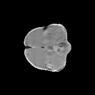

# BraTS Dataset 2D Preprocessor for YOLO Object Detection and U-Net Segmentation




## Summary

This repository provides a set of utility scripts to preprocess 3D `.nii.gz` Brain Tumor Segmentation Challenge (BraTS) brain scans into 2D "PNG slices" suitable for YOLO object detection and U-Net segmentation training. All functions are accessible via command-line arguments, and help can be accessed using the `--help` option.

## Features

- Converts BraTS `.nii.gz` files to 2D PNG slices.
- Organizes the output into separate directories for YOLO object detection and U-Net segmentation.
- Supports easy customization through command-line arguments.

## How to Use

1. **Sign Up to the BraTS Competition:**
   - Visit the [BraTS challenge website](https://braintumorsegmentation.org/) and sign up to download the dataset.

2. **Download the Dataset:**
   - Obtain the BraTS dataset for your desired year or edition.

3. **Make the Script Executable:**
   ```bash
   chmod +x process_all_mod.sh
    ```
4. **Set the Dataset Directory:**
   - Open process_all_mod.sh and update the DATASET_DIR variable to point to your BraTS dataset directory.
   - Alternatively, you can specify the dataset directory directly as a command-line argument.

5. **Run the Preprocessing Script:**
   ```bash
   ./process_all_mod.sh
    ```
    - This will generate 8 directories (depending on the modality of the BraTS competition), `*segmentation` directories are for U-NET and `detection` directories are for YOLO. Example: `t1c_segmentation/`, `t1n_detection/`

## Requirements
`TBD` At the moment run, the script and see which packages you're missing. Will compile the list later. 